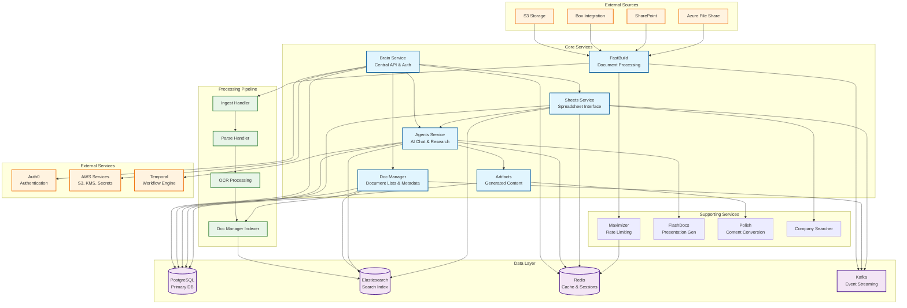

# Codebase Assessment  (Hebbia Mono, 9f95464d2a, December 19, 2024)

## 1. Executive Summary
- **Purpose**: Advanced document processing and AI-powered search platform with collaborative features
- **Tech Stack**: Python/FastAPI microservices, PostgreSQL, Elasticsearch, Redis, Kafka, React frontend
- **Architecture Style**: Event-driven microservices with shared database pattern
- **Health Score**: 7/10 - Well-structured but showing signs of scale stress
- **Top 3 Risks**: 1) Complex query performance in sheets service 2) Extensive shared database coupling 3) Inconsistent error handling patterns

## 2. Architecture Overview

The system follows a microservices architecture with a central brain service orchestrating document processing, AI agents, and collaborative spreadsheet functionality.

| Component | Purpose | Key Files | Direct Deps |
|-----------|---------|-----------|-------------|
| Brain | Central API, authentication, user management | brain/app.py, brain/models/ | PostgreSQL, Auth0, Redis |
| Agents | AI-powered chat, research, document analysis | agents/app.py, agents/agents/ | Brain, Doc Manager, Temporal |
| Doc Manager | Document lists, metadata, permissions | doc_manager/app.py, doc_manager/routes/ | PostgreSQL, Elasticsearch, Kafka |
| Sheets | Spreadsheet interface, data organization | sheets/app.py, sheets/data_layer/ | PostgreSQL, Redis, Kafka |
| FastBuild | Document processing pipeline | fastbuild/app.py, fastbuild/ingest/ | S3, Lambda handlers, Kafka |
| Artifacts | Generated content management | artifacts/app.py, artifacts/routes/ | PostgreSQL, Tiptap, Polish |

## 3. Data & Control Flow

**Document Ingestion Flow:**
1. External sources (S3, Box, SharePoint) → FastBuild ingestion
2. FastBuild processes documents (OCR, parsing, extraction) via Lambda handlers
3. Doc Manager Indexer indexes processed documents in Elasticsearch
4. Documents become searchable through Brain API and available in Sheets

**AI Chat Flow:**
1. User request → Brain service (authentication) → Agents service
2. Agents orchestrate multi-step research using framework pattern
3. Background task management ensures resilience to disconnections
4. Results streamed via Server-Sent Events with real-time loading states

**Sheets Processing Flow:**
1. User interactions → Sheets service → Complex SQL queries with caching
2. Redis caching for performance with S3 backup for large queries
3. Kafka events for cross-service communication and updates

## 4. Dependency Graph

**Third-party Dependencies:**
- fastapi==0.78.0 (core framework)
- sqlalchemy==1.4.50 (ORM, showing age)
- pydantic==1.10.13 (validation)
- redis==5.1.1 (caching)
- elasticsearch-dsl==8.15.0 (search)
- pytest==8.3.3 (testing)

**Critical Vulnerabilities:**
- Several dependencies showing age (SQLAlchemy 1.4.x, Pydantic 1.x)
- No automated dependency scanning apparent

**Internal Module Dependencies:**
- Extensive `python_lib/` shared library with ~65 modules
- Heavy coupling through shared database models in `brain/models/`
- Cross-service HTTP API calls creating tight coupling

## 5. Quality Metrics

| Metric | Value | Notes |
|--------|-------|-------|
| Lines of Code | ~327k (3,331 Python files) | Large monorepo with significant complexity |
| Test Coverage | ~7% (229 test files / 3,331 total) | Critically low test coverage |
| Avg File Complexity | High | Largest files >2,500 lines (sheets/routes/sheets.py) |
| Duplication | Medium | Shared patterns across services but good abstraction |

**Complexity Hotspots:**
- `sheets/routes/sheets.py`: 2,543 lines
- `sheets/data_layer/cells.py`: 2,109 lines
- `doc_manager/search/search_queries.py`: 2,034 lines
- `fastbuild/ingest/client.py`: 1,844 lines

## 6. Security Assessment

| Issue | Location | Severity | Recommendation |
|-------|----------|----------|----------------|
| Limited Auth Token Validation | python_lib/auth/ | Medium | Enhance token validation and expiry checks |
| Potential SQL Injection | Complex dynamic queries in sheets | Medium | Parameterize all dynamic SQL construction |
| Insufficient Input Validation | Various API endpoints | Medium | Standardize Pydantic validation across all services |
| Secrets in Environment Variables | Deployment configs | Low | Already using AWS Secrets Manager appropriately |
| Missing Rate Limiting | Some API endpoints | Low | Extend SlowAPI usage to all endpoints |

**Security Strengths:**
- Auth0 integration for authentication
- JWT-based authorization with RBAC
- AWS Secrets Manager for credential management
- Encrypted data at rest and in transit

## 7. Performance Assessment

| Bottleneck | Evidence | Impact | Suggested Fix |
|------------|----------|--------|---------------|
| Complex Sheets Queries | 50-second query timeouts, extensive caching | High | Query optimization, database indexing review |
| Document Processing Pipeline | Lambda cold starts, sequential processing | Medium | Parallel processing, keep-warm strategies |
| Redis Memory Usage | Large cache entries stored in S3 | Medium | Cache eviction policies, data structure optimization |
| Cross-Service HTTP Calls | Synchronous API dependencies | Medium | Implement circuit breakers, async patterns |

**Performance Monitoring:**
- Comprehensive DataDog integration
- Detailed query performance logging
- Redis and PostgreSQL monitoring
- S3 query result storage for analysis

## 8. Technical Debt & Code Smells

• **Large File Complexity**: Multiple files >1,500 lines violating single responsibility principle
• **Shared Database Anti-pattern**: All services sharing the same PostgreSQL schema creates tight coupling
• **Inconsistent Error Handling**: Mix of error handling patterns across services
• **SQL Query Complexity**: Highly complex dynamic SQL generation in sheets service
• **Test Coverage Deficit**: 7% test coverage is critically insufficient for production system
• **Dependency Staleness**: Key dependencies (SQLAlchemy, Pydantic) are 1-2 major versions behind
• **Configuration Complexity**: Multiple environment variable systems and configuration layers
• **Missing Documentation**: API documentation disabled in production, limited service documentation

## 9. Recommended Actions (Prioritised)

| Priority | Action | Owner Sub-Agent |
|----------|--------|-----------------|
| P0 | Implement comprehensive test suite (target 80% coverage) | testing-specialist |
| P0 | Optimize sheets service query performance and caching | performance-optimizer |
| P1 | Upgrade SQLAlchemy to 2.x and Pydantic to 2.x | dependency-manager |
| P1 | Implement database per service pattern | architecture-specialist |
| P2 | Standardize error handling across all services | code-reviewer |
| P2 | Break down large files into smaller, focused modules | refactoring-specialist |
| P3 | Add automated security scanning for dependencies | security-guardian |
| P3 | Implement API documentation generation | documentation-specialist |

## 10. Open Questions / Unknowns

• **Performance Baselines**: What are acceptable query response times for sheets operations?
• **Migration Strategy**: How to approach database decomposition without service downtime?
• **Test Strategy**: Should focus be on unit tests, integration tests, or end-to-end scenarios first?
• **Scaling Plans**: What are the expected growth patterns for document volume and user base?
• **Rollback Procedures**: What are the disaster recovery and rollback strategies for major deployments?

## 11. Appendix

### Architecture Strengths
- Well-defined service boundaries with clear responsibilities
- Comprehensive observability and monitoring
- Strong security foundation with Auth0 and RBAC
- Event-driven architecture with Kafka for decoupling
- Sophisticated document processing pipeline

### Key Architectural Decisions
- Monorepo structure enabling shared libraries and coordinated deployments
- FastAPI for high-performance async API development
- PostgreSQL as primary data store with Elasticsearch for search
- Redis for high-performance caching and session management
- AWS-native deployment with comprehensive secret management

### Development Workflow
- Docker-compose based local development
- GitHub Actions CI/CD with environment-specific deployments
- Feature flags via LaunchDarkly for controlled rollouts
- Comprehensive logging via DataDog for debugging and monitoring

### Assessment Methodology
This assessment was conducted using automated code analysis tools combined with architectural pattern recognition. Key metrics were derived from:
- Static code analysis of 3,331 Python files
- Database schema analysis from migration files
- Dependency analysis from requirements.txt files
- Performance pattern analysis from logging and caching implementations
- Security review of authentication and authorization patterns

---

**Assessment Date**: December 19, 2024
**Commit Hash**: 9f95464d2a
**Assessment Tool**: Claude Code Archaeologist

The codebase represents a sophisticated, production-ready system with strong architectural foundations but requiring immediate attention to performance optimization, test coverage, and technical debt reduction.
