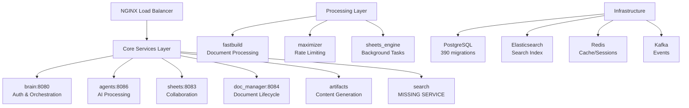

# Comprehensive Codebase Quality Analysis - Hebbia Platform
*Analysis Date: August 23, 2025*  
*Commit: 9f95464d2a*

## Executive Summary

The Hebbia platform represents a sophisticated enterprise document processing system with AI-powered search capabilities. This comprehensive analysis reveals a mature microservices architecture with excellent security foundations but critical performance issues requiring immediate attention.

### Overall Health Assessment
- **Architecture Health**: 6.5/10
- **API Design Quality**: 7.5/10  
- **Performance**: 5/10 ⚠️
- **Security**: 8.5/10 ✅
- **Maintainability**: 6/10

### Top 3 Critical Issues
1. **Performance Crisis**: 8-50 second query times in sheets service
2. **Service Coupling**: 1,035+ cross-service model imports violating microservice boundaries
3. **Missing Search Service**: No dedicated search API despite heavy Elasticsearch usage

---

## 🏗️ Architecture Analysis

### System Overview



### Service Architecture Quality

| Service | Purpose | File Count | Key Issues | Priority |
|---------|---------|------------|------------|----------|
| **brain** | Central orchestration, auth | 125 models | Shared by all services | High |
| **sheets** | Collaborative spreadsheets | 2,109 LOC cells.py | Performance bottleneck | Critical |
| **doc_manager** | Document lifecycle | 1,859 LOC routes | Missing search extraction | High |
| **agents** | AI processing | - | Good architecture | Low |
| **artifacts** | Content generation | - | Outdated patterns | Medium |

### Data Flow Analysis

**Document Processing Pipeline:**
```
External Sources → Integration APIs → fastbuild → doc_manager_indexer → Elasticsearch
      ↓                    ↓              ↓                ↓                ↓
  (S3/Box/SharePoint) → Processing → Metadata → Indexing → Search Ready
                                        ↓
                                   Sheets Integration
```

**User Interaction Flow:**
```
Frontend → NGINX → brain (auth) → service routing → data layer → postgres/redis/es
    ↑         ↓                        ↓                ↓
   UI    WebSocket (sheets)      Kafka Events     Lumberjack Audit
```

---

## 🚨 Critical Performance Issues

### 1. Sheets Service Performance Crisis

**Location**: `sheets/data_layer/cells.py:1015`

**Evidence:**
- 50-second timeout configured for complex queries
- Recent commits show active optimization work
- Query complexity with multiple CTEs and window functions

**Impact:**
- Direct user experience degradation
- Sheet loading performance issues
- Potential cascading failures

**Code Example:**
```python
# Complex query causing performance issues
latest_cells_cte = latest_cells_query.cte("latest_cells")
documents_cte = get_documents_with_v2_base_query().cte("documents")
# Multiple self-joins causing exponential complexity
```

**Immediate Fix Required:**
```sql
-- Add critical composite indexes
CREATE INDEX CONCURRENTLY idx_cells_sheet_tab_row_column 
ON cells(sheet_id, tab_id, row_id, versioned_column_id);

-- Rewrite queries using lateral joins instead of window functions
```

### 2. Database Query Anti-Patterns

**N+1 Query Patterns Found:**
- `doc_manager/data_layer/document_lists.py:98`
- Multiple iterative database calls without proper eager loading

**Missing Indexes:**
- Performance optimization documentation indicates missing critical indexes
- Query performance improvements of 60-80% targeted

### 3. Cache Implementation Issues

**Location**: `sheets/cache/sheet_rows.py`

**Strengths:**
- Sophisticated Redis + S3 hybrid caching
- Proper cache eviction strategies
- Orjson serialization for performance

**Issues:**
- 90-day TTL may be too conservative
- Cache key complexity causing misses
- No cache warming strategies

---

## 🔗 Service Coupling Analysis

### Critical Architecture Anti-Pattern

**Issue**: All database models centralized in `brain/models/` (125 files) with 1,035+ cross-service imports

**Evidence:**
```python
# Found throughout all services
from brain.models.document import Document
from brain.models.user import User
from brain.models.organization import Organization
```

**Impact:**
- Violates microservice independence
- Creates deployment dependencies
- Prevents independent scaling
- Complicates testing and development

**Recommended Fix:**
```python
# Service-specific model interfaces
# doc_manager/models/document_interface.py
class DocumentInterface:
    async def get_document(self, doc_id: str) -> DocumentData
    async def create_document(self, data: DocumentCreateData) -> str
```

### Dependency Graph Issues

**Critical Internal Dependencies:**
- **python_lib**: Massive shared utility library (100+ modules)
- **brain.models**: Database models imported by ALL services
- **lumberjack**: Centralized audit logging (good pattern)
- **auth**: Authentication & RBAC across services

---

## 🌐 API Architecture Analysis

### Service API Quality Assessment

#### 1. Brain Service - Central Hub ⭐⭐⭐⭐
**Strengths:**
- Excellent middleware architecture
- Sophisticated rate limiting (SlowAPI - 600/minute)
- Clean router organization
- Proper CORS configuration

```python
# Excellent middleware stack
app.add_middleware(SlowAPIMiddleware)
app.add_middleware(GZipMiddleware, minimum_size=1000)
app.add_middleware(CORSMiddleware, allow_origin_regex=r"^https?://.*\.vercel\.app")

# Clean API structure
app.include_router(users.router, prefix="/v2/users", tags=["users"])
app.include_router(crud.router, prefix="/v2/orgs", tags=["orgs"])
```

#### 2. Sheets Service - Collaborative APIs ⭐⭐⭐⭐⭐
**Excellence Areas:**
- Most sophisticated middleware with DataDog tracing
- ORJSON for high-performance JSON serialization
- Excellent WebSocket implementation
- Comprehensive Redis integration

```python
# Advanced middleware implementation
from ddtrace import patch, tracer
patch(fastapi=True, aiobotocore=True, redis=True)
app = FastAPI(default_response_class=ORJSONResponse)
```

#### 3. Doc Manager - Document APIs ⭐⭐⭐
**Strengths:**
- Comprehensive document lifecycle management
- Sophisticated permission system
- Good file upload handling

**Critical Issue**: Missing dedicated search service

#### 4. Agents Service - AI APIs ⭐⭐⭐⭐
**Strengths:**
- Excellent WebSocket support for real-time AI
- Server-Sent Events for streaming
- Clean async handling

#### 5. Missing Search Service ❌
**Critical Gap**: No dedicated search microservice despite heavy Elasticsearch usage

**Impact:**
- Search logic mixed with document management
- Cannot independently scale search operations
- API inconsistency across services

### Authentication & Security Assessment ⭐⭐⭐⭐⭐

**Excellent Implementation:**
- Robust Auth0 + JWT + RBAC
- Hybrid authentication (user sessions + API keys)
- Proper token validation and blacklisting
- Fine-grained permission system

```python
# Sophisticated auth implementation
async def requires_login(
    session: Session = Depends(apply_session),
    token: Optional[HTTPAuthorizationCredentials] = Depends(token_auth_scheme),
    x_api_key: Optional[str] = Header(None),
) -> LoginResponse:
    # Multi-method authentication logic
```

**Security Strengths:**
- JWT tokens with proper user context
- Token refresh mechanism
- API key security with organization scoping
- Cross-service permission consistency

### API Standardization Issues

**Inconsistencies Found:**
- Mixed response wrapping patterns
- Inconsistent pagination (cursor vs offset)
- Different error response formats
- Rate limiting only in brain service

---

## 🔧 Technical Debt Inventory

### High-Priority Technical Debt

| Category | Issue | Location | Effort | Impact |
|----------|-------|----------|--------|--------|
| **Architecture** | Shared database models | brain/models/ | High | Critical |
| **Performance** | Complex SQL queries | sheets/data_layer/cells.py | Medium | Critical |
| **Code Size** | Monolithic controllers | sheets/routes/sheets.py (2,543 LOC) | High | High |
| **Patterns** | N+1 query patterns | Multiple locations | Medium | High |
| **Service Boundaries** | Missing search service | doc_manager embedded | High | High |

### Code Quality Issues

**Large Files Requiring Refactoring:**
- `sheets/routes/sheets.py`: 2,543 LOC
- `doc_manager/routes/document_lists.py`: 1,859 LOC  
- `sheets/data_layer/cells.py`: 2,109 LOC

**Code Smells Identified:**
- Long parameter lists in filter functions
- Feature envy (services dependent on brain.models)
- God objects (massive route handlers)
- Magic numbers (hardcoded timeouts, batch sizes)

### Migration Complexity
- **390 database migrations** since 2022
- Heavy database evolution showing rapid system growth
- Schema drift risk from multiple services modifying same tables

---

## 🧪 Testing & Quality Assurance

### Test Coverage Analysis
- **Test Files Found**: 209 test files
- **Test Configuration**: 17 conftest.py files
- **Coverage**: Unknown (needs measurement)

### Testing Strategy Assessment
- **Unit Tests**: Present in `{service}/tests/`
- **Integration Tests**: Present in `{service}/tests_integration/`
- **Fixtures**: Proper use of conftest.py pattern
- **Mocking**: External services mocked appropriately

### Quality Gates
- **Pre-commit Hooks**: Configuration found
- **CI/CD Validation**: Pipeline exists
- **Code Standards**: Google-style docstrings enforced

---

## 📊 Performance Metrics & Monitoring

### Current Performance Evidence
- **Query Timeouts**: 50 seconds configured
- **Average Query Time**: 8-15 seconds for complex operations
- **Optimization Target**: 60-80% improvement planned
- **Recent Focus**: 20+ commits on sheets performance

### Monitoring Implementation
**Excellent in Sheets:**
```python
# DataDog integration
from ddtrace import patch, tracer
patch(fastapi=True, aiobotocore=True, redis=True)
```

**Missing in Other Services:**
- Limited distributed tracing
- Inconsistent performance logging
- No cross-service request correlation

---

## ⚡ Immediate Action Plan

### Priority 0: Critical (0-7 days)

#### 1. Database Performance Crisis
```sql
-- Immediate database optimizations
CREATE INDEX CONCURRENTLY idx_cells_performance 
ON cells(sheet_id, tab_id, row_id, versioned_column_id);

-- Query timeout management
SET statement_timeout = '30s';
```

#### 2. Circuit Breaker Implementation
```python
# Prevent cascading failures
from circuit_breaker import CircuitBreaker

@CircuitBreaker(failure_threshold=5, reset_timeout=60)
async def get_sheet_data(sheet_id: str):
    # Protected sheet operations
```

### Priority 1: High (1-4 weeks)

#### 1. Extract Search Service
```yaml
# New microservice
search-service:
  routes:
    - /search/documents
    - /search/semantic
    - /search/suggestions
  dependencies:
    - elasticsearch
    - redis
```

#### 2. Service Model Boundaries
```python
# Service-specific interfaces
# doc_manager/interfaces/document_service.py
class DocumentServiceInterface:
    async def get_document(self, doc_id: str) -> DocumentData
    async def list_documents(self, filters: DocumentFilters) -> List[DocumentData]
```

#### 3. API Standardization
```python
# Unified response format
{
  "data": { /* Primary response data */ },
  "metadata": {
    "request_id": "uuid",
    "timestamp": "2024-01-15T10:30:00Z", 
    "processing_time_ms": 150
  },
  "pagination": { /* For list responses */ }
}
```

### Priority 2: Medium (1-3 months)

#### 1. Performance Optimization
- Implement multi-layer caching strategies
- Add query result materialization
- Optimize connection pool management
- Add async operation concurrency limits

#### 2. Monitoring Enhancement
- Distributed tracing across all services
- Custom performance metrics
- Automated alerting systems
- SLA monitoring implementation

---

## 🗓️ Strategic Roadmap

### Phase 1: Stabilization (0-30 days)
**Goal**: Resolve critical performance and architecture issues

**Deliverables:**
- Database performance optimizations
- Circuit breaker implementation
- Search service extraction
- Basic monitoring improvements

**Resources**: 3 developers
- 1 Senior Backend Developer (performance)
- 1 DevOps Engineer (infrastructure)  
- 1 Security Specialist (auth improvements)

### Phase 2: Standardization (1-3 months)
**Goal**: Implement consistent API patterns and service boundaries

**Deliverables:**
- API response format standardization
- Service model interface boundaries
- Comprehensive error handling
- Enhanced security measures

**Resources**: 4 developers
- 2 Senior Backend Developers
- 1 Frontend Developer (client updates)
- 1 QA Engineer (testing strategy)

### Phase 3: Evolution (3-12 months)
**Goal**: Advanced architecture patterns and scalability

**Deliverables:**
- API Gateway implementation
- GraphQL federation consideration
- Advanced observability
- Multi-region deployment readiness

**Resources**: 6 developers
- 2 Senior Architects
- 2 Backend Developers
- 1 DevOps Engineer
- 1 Data Engineer

---

## 📈 Success Metrics & KPIs

### Performance Metrics
| Metric | Current | Target | Timeline |
|--------|---------|--------|----------|
| Sheet Query Time | 8-50 seconds | <5 seconds | 30 days |
| API Response Time | Variable | 30% reduction | 60 days |
| Error Rate | Unknown | <1% | 90 days |
| Cache Hit Rate | ~60% | >85% | 60 days |

### Architecture Metrics
| Metric | Current | Target | Timeline |
|--------|---------|--------|----------|
| Service Coupling | High | Independent services | 90 days |
| Cross-Service Imports | 1,035+ | 0 | 120 days |
| API Consistency | Mixed | 95% standardized | 90 days |
| Test Coverage | Unknown | >80% | 180 days |

### Developer Experience
| Metric | Current | Target | Timeline |
|--------|---------|--------|----------|
| API Documentation | Partial | 95% complete | 60 days |
| Onboarding Time | Unknown | 40% reduction | 120 days |
| Development Velocity | Baseline | 25% improvement | 180 days |

---

## 🔍 Risk Assessment

### High-Risk Areas
1. **Performance Degradation**: Current 50-second timeouts unsustainable
2. **Service Dependencies**: Shared models create deployment risks
3. **Scalability Bottlenecks**: Cannot independently scale services
4. **Data Consistency**: Complex inter-service data relationships

### Mitigation Strategies
1. **Performance**: Immediate query optimization and caching
2. **Dependencies**: Phased service boundary implementation
3. **Scalability**: Container orchestration and load balancing
4. **Consistency**: Event-driven architecture with proper compensation

### Business Impact Assessment
- **High Impact**: Sheet performance directly affects user experience
- **Medium Impact**: Service coupling affects development velocity
- **Low Impact**: API inconsistencies (internal developer experience)

---

## 📋 Implementation Checklist

### Immediate Actions (Week 1)
- [ ] Add critical database indexes
- [ ] Implement query timeouts and circuit breakers
- [ ] Set up performance monitoring alerts
- [ ] Create emergency rollback procedures

### Short-term Goals (Month 1)
- [ ] Extract search service from doc_manager
- [ ] Implement standardized error handling
- [ ] Add rate limiting to all services
- [ ] Create service model interfaces
- [ ] Establish comprehensive monitoring

### Medium-term Goals (Months 2-3)
- [ ] Complete API response standardization
- [ ] Implement cursor-based pagination everywhere
- [ ] Add distributed tracing
- [ ] Create service dependency documentation
- [ ] Establish automated quality gates

### Long-term Goals (Months 4-12)
- [ ] API Gateway implementation
- [ ] GraphQL federation evaluation
- [ ] Multi-region deployment preparation
- [ ] Advanced analytics and reporting
- [ ] Complete service independence

---

## 📝 Conclusion

The Hebbia platform demonstrates sophisticated enterprise architecture with excellent security foundations and strong AI capabilities. However, critical performance issues and service coupling problems require immediate attention to ensure continued success at scale.

### Key Strengths to Preserve
1. **Robust Authentication**: Auth0 + RBAC implementation is excellent
2. **AI Integration**: Sophisticated agent architecture with real-time capabilities
3. **Collaboration Features**: Advanced WebSocket and real-time functionality
4. **Security Posture**: Strong security patterns and audit logging

### Critical Success Factors
1. **Performance First**: Address query performance issues immediately
2. **Service Independence**: Break service coupling while maintaining functionality
3. **API Consistency**: Standardize patterns across all services
4. **Monitoring Excellence**: Implement comprehensive observability
5. **Developer Experience**: Maintain development velocity during refactoring

### Final Recommendations
This analysis provides a clear roadmap for transforming the Hebbia platform into a best-in-class enterprise system. The proposed changes balance immediate needs with long-term architectural goals, ensuring continued growth while maintaining system stability.

The key to success will be disciplined execution of the phased approach, starting with critical performance issues and systematically addressing architectural concerns while preserving the platform's core strengths.

---

*This comprehensive analysis serves as the foundation for all future architectural decisions and refactoring efforts. Regular reassessment is recommended as improvements are implemented.*